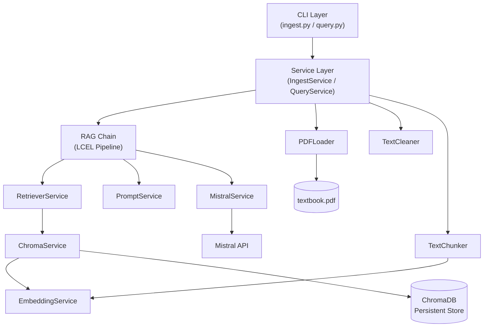

# 📚 Marathi RAG Tutor

A production-quality **Retrieval-Augmented Generation (RAG)** backend for Maharashtra State Board Marathi textbooks. Built as Phase 1 of an AI Tutoring Platform — designed for extensibility from day one.

> Every answer is grounded exclusively in the uploaded textbook. If the textbook doesn't contain the answer, the system explicitly says so. **No hallucination. No outside knowledge.**

---

## 🏗️ Architecture



### Design Principles
- **SOLID Principles** throughout — Single Responsibility, Dependency Injection, Interface Segregation
- **No hardcoded paths** — everything configurable via `.env` and `settings.py`
- **Service layer pattern** — CLI → Service → Domain Logic → Infrastructure
- **Future-ready metadata** — `textbook_id`, `standard`, `chapter` in every chunk, ready for multi-book expansion

---

## 📁 Project Structure

```
marathi-rag/
├── app/
│   ├── config/
│   │   ├── settings.py          # Pydantic BaseSettings (all tunables)
│   │   └── constants.py         # String constants, metadata keys, defaults
│   ├── ingestion/
│   │   └── pdf_loader.py        # PyMuPDF-based PDF text extractor
│   ├── preprocessing/
│   │   ├── cleaner.py           # Unicode normalization, header/footer removal
│   │   └── chunker.py           # RecursiveCharacterTextSplitter + chapter detection
│   ├── embeddings/
│   │   └── embedding_service.py # BAAI/bge-m3 with fallback
│   ├── vectorstore/
│   │   └── chroma_service.py    # ChromaDB CRUD wrapper
│   ├── retrieval/
│   │   └── retriever.py         # Configurable LangChain retriever
│   ├── llm/
│   │   └── mistral_service.py   # ChatMistralAI wrapper
│   ├── prompts/
│   │   └── rag_prompt.py        # Centralized Marathi prompt template
│   ├── chains/
│   │   └── rag_chain.py         # LCEL RAG pipeline
│   ├── services/
│   │   ├── ingest_service.py    # Ingestion orchestrator
│   │   └── query_service.py     # Query orchestrator
│   ├── evaluation/
│   │   └── retrieval_debugger.py # Retrieval inspection tool
│   ├── utils/
│   │   ├── logger.py            # Centralized logging (Rich + file)
│   │   └── helpers.py           # Timing decorator, file validation, Unicode utils
│   └── cli/
│       ├── ingest.py            # python -m app.cli.ingest
│       └── query.py             # python -m app.cli.query
├── data/
│   └── textbook.pdf             # Maharashtra State Board Marathi Std. 6
├── chroma/                      # ChromaDB persistent storage (auto-created)
├── logs/                        # Application logs (auto-created)
├── tests/                       # pytest test suite
├── .env.example                 # Environment variable template
├── requirements.txt             # Pinned dependencies
└── README.md
```

---

## 🚀 Installation

### Prerequisites
- Python 3.12+
- ~3 GB disk space (for embedding model download)
- Mistral AI API key ([Get one here](https://console.mistral.ai/))

### Setup

```bash
# 1. Clone/navigate to the project
cd marathi-rag

# 2. Create virtual environment
python -m venv venv
venv\Scripts\activate        # Windows
# source venv/bin/activate   # Linux/Mac

# 3. Install dependencies
pip install -r requirements.txt

# 4. Configure environment
copy .env.example .env
# Edit .env and add your MISTRAL_API_KEY

# 5. Place the textbook PDF
# Copy your Marathi textbook PDF to data/textbook.pdf
```

---

## 📥 Ingestion Pipeline

Ingest the textbook into the vector database:

```bash
python -m app.cli.ingest
```

### What happens:
1. **PDF Extraction** — PyMuPDF extracts Unicode Marathi text page-by-page
2. **Text Cleaning** — Removes headers, footers, page numbers, OCR artifacts; normalizes Unicode
3. **Chunking** — Splits into ~400-character chunks with 80-char overlap using Marathi-aware separators
4. **Embedding** — Generates vectors using BAAI/bge-m3 (multilingual embedding model)
5. **Storage** — Stores chunks + metadata in ChromaDB with persistent storage

### Output:
```
📊 Ingestion Results
┌───────────────────────┬──────────────────────┐
│ Metric                │ Value                │
├───────────────────────┼──────────────────────┤
│ Total Pages           │ 148                  │
│ Extracted Pages       │ 142                  │
│ Total Chunks          │ 523                  │
│ Documents Stored      │ 523                  │
│ Total Time            │ 2m 15.3s             │
└───────────────────────┴──────────────────────┘
```

---

## 💬 Query Interface

Start the interactive query REPL:

```bash
python -m app.cli.query
```

### Usage:
```
> या कवितेचा अर्थ काय आहे?

📄 Retrieved Chunks
┌───┬────────┬──────┬─────────────┬───────────────────────┐
│ # │ Score  │ Page │ Chapter     │ Preview               │
├───┼────────┼──────┼─────────────┼───────────────────────┤
│ 1 │ 0.2341 │ 23   │ कविता 3     │ या कवितेत कवीने...    │
│ 2 │ 0.3012 │ 24   │ कविता 3     │ कवितेचा भावार्थ...    │
└───┴────────┴──────┴─────────────┴───────────────────────┘

🎓 उत्तर (Answer)
╭──────────────────────────────────────────────────╮
│ या कवितेत कवीने निसर्गाचे वर्णन केले आहे...    │
│                                                  │
│ (पृष्ठ: २३, २४)                                  │
╰──────────────────────────────────────────────────╯
```

---

## ⚙️ Configuration

All settings are configurable via `.env` or environment variables:

| Variable | Default | Description |
|----------|---------|-------------|
| `MISTRAL_API_KEY` | (required) | Mistral AI API key |
| `MISTRAL_MODEL_NAME` | `mistral-large-latest` | Mistral model identifier |
| `MISTRAL_TEMPERATURE` | `0.3` | Generation temperature |
| `EMBEDDING_MODEL_NAME` | `BAAI/bge-m3` | HuggingFace embedding model |
| `CHUNK_SIZE` | `400` | Characters per chunk |
| `CHUNK_OVERLAP` | `80` | Overlap between chunks |
| `RETRIEVER_TOP_K` | `5` | Number of chunks to retrieve |
| `PDF_PATH` | `data/textbook.pdf` | Path to textbook PDF |
| `CHROMA_PERSIST_DIR` | `chroma` | ChromaDB storage directory |
| `LOG_LEVEL` | `INFO` | Logging verbosity |

---

## 🧪 Testing

```bash
# Run all fast tests
pytest tests/ -v

# Run all tests including slow ones (requires model download)
pytest tests/ -v -m "not slow"

# Run specific test file
pytest tests/test_cleaner.py -v
```

---

## 🗺️ Future Roadmap (Phases 2–N)

The architecture is designed to support these features **without rewriting**:

- [ ] **Multi-textbook support** (Std. 6–10) — via `textbook_id` metadata filtering
- [ ] **Student profiles** — track individual learning progress
- [ ] **Conversation memory** — multi-turn contextual conversations
- [ ] **Quiz generation** — auto-generate questions from textbook chunks
- [ ] **Adaptive learning** — adjust difficulty based on student performance
- [ ] **Bloom's Taxonomy** — tag questions and content by cognitive level
- [ ] **Teacher dashboard** — analytics and monitoring interface
- [ ] **Multi-agent workflow** — specialized agents for different tasks
- [ ] **FastAPI REST API** — expose as a web service
- [ ] **OCR pipeline** — handle scanned/image-based PDFs

---

## ⚠️ Known Limitations

1. **Text-based PDFs only** — The current pipeline extracts text directly. Scanned/image-based PDFs require an OCR layer (planned for future).
2. **Chapter detection is best-effort** — Relies on regex patterns for Marathi headings (`पाठ`, `कविता`, `धडा`). Non-standard formatting may not be detected.
3. **Single textbook** — Phase 1 supports one textbook. The metadata schema supports multiple books, but the UI/CLI doesn't yet.
4. **Embedding model size** — BAAI/bge-m3 requires ~2.3 GB of disk space and RAM.
5. **API dependency** — Requires a valid Mistral API key and internet connectivity for generation.

---

## 📄 License

This project is part of a Final Year academic project. For educational use only.

---

## 🙏 Tech Stack

| Component | Technology |
|-----------|-----------|
| Language | Python 3.12 |
| Framework | LangChain (LCEL) |
| LLM | Mistral AI (ChatMistralAI) |
| Embeddings | BAAI/bge-m3 (HuggingFace) |
| Vector DB | ChromaDB |
| PDF Extraction | PyMuPDF |
| Configuration | Pydantic Settings |
| CLI | Rich |
| Testing | pytest |
